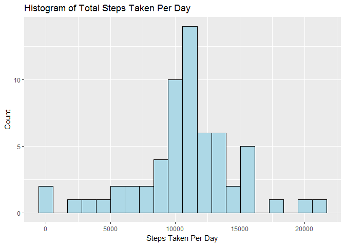

# Reproducible Research: Peer Assessment One

## Loading and preprocessing the data
* Loads the data as well as initial processing and transformations of the data


```r
library(ggplot2)

unzip("activity.zip")
activity <- read.csv("activity.csv", header = TRUE, sep = ",")

activity_total <- aggregate(activity$steps, by=list(Category=activity$date), FUN=sum, na.rm=TRUE)
activity_avg <- aggregate(activity$steps, by=list(interval=activity$interval), FUN=mean, na.rm=TRUE)
activity_day_avg <- aggregate(activity$steps, by=list(date=activity$date), FUN=mean, na.rm=TRUE)
```

## What is mean total number of steps taken per day?
* Histogram of the total number of steps taken each day
* Median and mean of the total number of steps taken per day


```r
g <- ggplot(activity_total, aes(x))
g + geom_histogram(bins = 20, color="black", fill="light blue") + ggtitle("Histogram of Total Steps Taken Per Day") + xlab("Steps Taken Per Day") + ylab("Count")
```

<!-- -->

```r
median(activity_total$x, na.rm = TRUE)
```

```
## [1] 10395
```

```r
mean(activity_total$x, na.rm = TRUE)
```

```
## [1] 9354.23
```

## What is the average daily activity pattern?
* Time series plot of the 5-minute interval (x-axis) and the average number of steps taken, averaged across all days (y-axis)
* The 5-minute interval, on average across all the days in the dataset, containing the maximum number of steps


```r
f <- ggplot(activity_avg, aes(interval, x))
f + geom_point(color="royalblue") + geom_line() + ggtitle("Average Daily Activity") + xlab("5-minute Interval Period") + ylab("Average Steps Taken")
```

<!-- -->

```r
subset(activity_avg, x==max(activity_avg$x))
```

```
##     interval        x
## 104      835 206.1698
```

## Imputing missing values
There are a number of days/intervals where there are missing values (coded as NA). The presence of missing days may introduce bias into some calculations or summaries of the data.

* Total number of missing values in the dataset (i.e. the total number of rows with NAs)
* Updated dataset that is equal to the original dataset but with the missing data filled in using activity average steps per interval
* Histogram of the total number of steps taken each day 
* Median and mean total number of steps taken per day
* These values differ from the estimates from the first part of the assignment. The impacts of imputing missing data on the estimates of the total daily number of steps are a higher median and mean values.


```r
missing_val <- activity[!complete.cases(activity),]
nrow(missing_val)
```

```
## [1] 2304
```

```r
missing_val$steps <- activity_avg[match(missing_val$interval, activity_avg$interval),2]
new_activity <- na.omit(activity)
new_activity <- rbind(new_activity, missing_val)

new_activity_total <- aggregate(new_activity$steps, by=list(Category=new_activity$date), FUN=sum, na.rm=TRUE)

g <- ggplot(new_activity_total, aes(x))
g + geom_histogram(bins = 20, color="black", fill="light blue") + ggtitle("Histogram of Total Steps Taken Per Day") + xlab("Steps Taken Per Day") + ylab("Count")
```

<!-- -->

```r
median(new_activity_total$x, na.rm = TRUE)
```

```
## [1] 10766.19
```

```r
mean(new_activity_total$x, na.rm = TRUE)
```

```
## [1] 10766.19
```

## Are there differences in activity patterns between weekdays and weekends?
* Creating a new factor variable in the dataset with two levels - "weekday" and "weekend" indicating whether a given date is a weekday or weekend day from the weekdays function and an if-else statement
* Panel plot containing a time series plot of the 5-minute interval (x-axis) and the average number of steps taken, averaged across all weekday days or weekend days (y-axis). There is a difference between weekday and weekend intervals which may be due to lower levels of walking during work (sitting at your desk for extended periods of time).


```r
new_activity$weekday <- as.factor(weekdays(as.Date(new_activity$date)))
new_activity$dow <- as.factor(ifelse(new_activity$weekday == "Saturday" | new_activity$weekday == "Sunday", "Weekend", "Weekday"))

new_activity_int_avg <- aggregate(new_activity$steps, by=list(interval=new_activity$interval, dow=new_activity$dow), FUN=mean, na.rm=TRUE)

h <- ggplot(new_activity_int_avg, aes(interval, x, group = 1))
h + geom_point(color="royalblue") + geom_line() + ggtitle("Average Daily Activity, Weekday vs Weekend") + xlab("Interval") + ylab("Average Steps Taken") + facet_grid(dow~.)
```

<!-- -->
